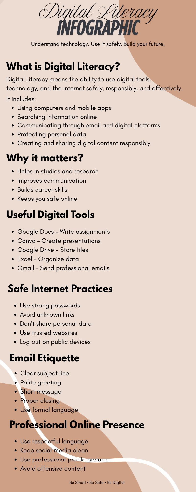

# Task 1: Digital Literacy Infographic

## Overview
This task involved designing a one-page infographic on Digital Literacy using Canva. The goal was to present important concepts related to digital awareness in a clear, visually appealing, and easy-to-understand format targeted at college students.

## Tool Used
- **Canva** — free, browser-based graphic design platform

## What the Infographic Covers
- **What is Digital Literacy?** — Definition and key components
- **Why it Matters** — Benefits for students in academic and professional life
- **Useful Digital Tools** — Everyday tools for productivity and communication
- **Safe Internet Practices** — Basic habits to stay safe online
- **Email Etiquette** — How to communicate professionally via email
- **Professional Online Presence** — How to present yourself responsibly online

## Preview

## Key Takeaway
> *Understand technology. Use it safely. Build your future.*
